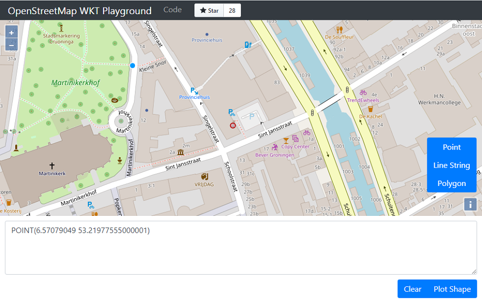
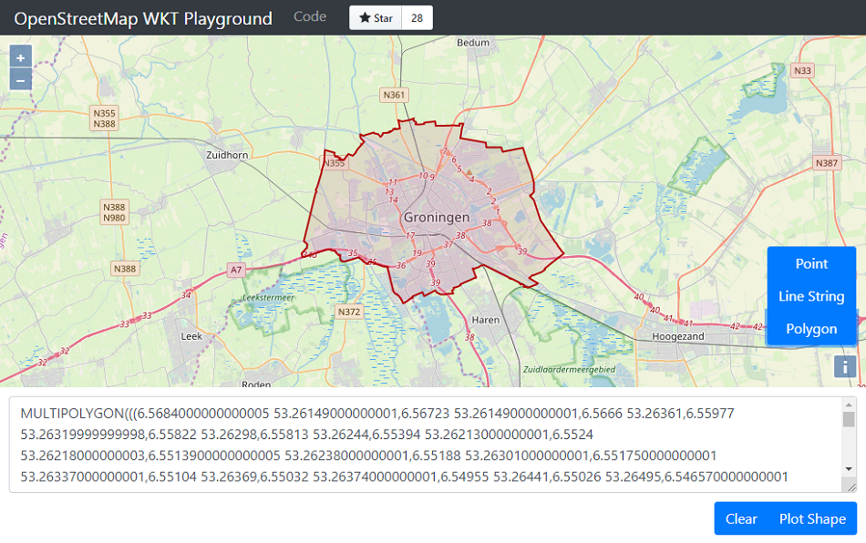

# free service {#free}

Met de free service kun je locatiegegevens, bijvoorbeeld een adres, verrijken met coördinaten. De service biedt ook de mogelijkheid om gegevens te standaardiseren. Zo kun je van adressen de officiële schrijfwijze ophalen uit de Basisregistratie Adressen en Gebouwen (BAG). De free service levert daarnaast identificatienummers waarmee je eenduidige koppelingen kunt leggen met gegevens in andere registraties.

De URL van de free service is 
```
https://geodata.nationaalgeoregister.nl/locatieserver/3/free
```

## Zoeken op vrije tekst
Laten we beginnen met een simpele bevraging (ofwel _request_) waarin we zoeken op het adres van het provinciehuis in Groningen.


Hiervoor breiden we de URL uit met de query parameter <span style='font-family: Consolas,"Liberation Mono",Menlo,Courier,monospace;'>q</span>.

<table style='border-collapse:collapse;border: solid 1px #dedede;background: #fff;text-align: left'>
<colgroup>
<col style="width: 20%;">
<col style="width: 40%;">
<col style="width: 40%;">
</colgroup>
  <thead>
    <tr>
      <th style='border: solid 1px #dedede;'>Parameter</th>
      <th style='border: solid 1px #dedede;'>Waarde</th>
      <th style='border: solid 1px #dedede;'>Beschrijving</th>
    </tr>
  </thead>
  <tbody>
    <tr> 
      <td style='border: solid 1px #dedede;'><span style='font-family: Consolas,"Liberation Mono",Menlo,Courier,monospace;'>q</span></td> 
      <td style='border: solid 1px #dedede;'><span style='font-family: Consolas,"Liberation Mono",Menlo,Courier,monospace;'>Sint Jansstraat 4 Groningen</span></td> 
      <td style='border: solid 1px #dedede;'>zoekterm</td> 
    </tr> 
  </tbody>
</table>

Het request wordt dan     
<pre>
<code><a href="https://geodata.nationaalgeoregister.nl/locatieserver/v3/free?q=Sint%20Jansstraat%204%20Groningen">https://geodata.nationaalgeoregister.nl/locatieserver/3/free?q=Sint Jansstraat 4 Groningen</a></code>
</pre>

Klik op bovenstaande hyperlink en bekijk het antwoord dat je terugkrijgt (de _response_). De response bevat tien zoekresultaten, ofwel rijen. Elke rij bestaat uit een aantal velden. Het aantal en het soort velden kan per rij verschillen.

Om het iets overzichtelijker te maken, maken we een nieuw request. Deze keer beperken we het aantal rijen en velden met de parameters <span style='font-family: Consolas,"Liberation Mono",Menlo,Courier,monospace;'>rows</span> en <span style='font-family: Consolas,"Liberation Mono",Menlo,Courier,monospace;'>fl</span>.

<table style='border-collapse:collapse;border: solid 1px #dedede;background: #fff;text-align: left'>
<colgroup>
<col style="width: 20%;">
<col style="width: 40%;">
<col style="width: 40%;">
</colgroup>
  <thead>
    <tr>
      <th style='border: solid 1px #dedede;'>Parameter</th>
      <th style='border: solid 1px #dedede;'>Waarde</th>
      <th style='border: solid 1px #dedede;'>Beschrijving</th>
    </tr>
  </thead>
  <tbody>
    <tr> 
      <td style='border: solid 1px #dedede;'><span style='font-family: Consolas,"Liberation Mono",Menlo,Courier,monospace;'>q</span></td> 
      <td style='border: solid 1px #dedede;'><span style='font-family: Consolas,"Liberation Mono",Menlo,Courier,monospace;'>Sint Jansstraat 4 Groningen</span></td> 
      <td style='border: solid 1px #dedede;'>zoekterm</td> 
    </tr> 
        <tr> 
      <td style='border: solid 1px #dedede;background: #fff;'><span style='font-family: Consolas,"Liberation Mono",Menlo,Courier,monospace;'>rows</span></td> 
      <td style='border: solid 1px #dedede;background: #fff;'><span style='font-family: Consolas,"Liberation Mono",Menlo,Courier,monospace;'>5</span></td> 
      <td style='border: solid 1px #dedede;background: #fff;'>maximum aantal rijen in de response</td> 
    </tr> 
        <tr> 
      <td style='border: solid 1px #dedede;'><span style='font-family: Consolas,"Liberation Mono",Menlo,Courier,monospace;'>fl</span></td> 
      <td style='border: solid 1px #dedede;'><span style='font-family: Consolas,"Liberation Mono",Menlo,Courier,monospace;'>weergavenaam,type,score</span></td> 
      <td style='border: solid 1px #dedede;'>lijst met velden in de response</td> 
    </tr> 
  </tbody>
</table>
Request:     
<pre><code><a href="https://geodata.nationaalgeoregister.nl/locatieserver/v3/free?q=Sint%20Jansstraat%204%20Groningen&rows=5&fl=weergavenaam,type,score">https://geodata.nationaalgeoregister.nl/locatieserver/v3/free?q=Sint Jansstraat 4 Groningen&rows=5&fl=weergavenaam,type,score</a></code></pre>
Response:
```
{
    "response": {
        "numFound": 538023,
        "start": 0,
        "maxScore": 36.76614,
        "docs": [{
                "type": "weg",
                "weergavenaam": "Sint Jansstraat, Groningen",
                "score": 36.76614
            }, {
                "type": "weg",
                "weergavenaam": "Nieuwe Sint Jansstraat, Groningen",
                "score": 35.70356
            }, {
                "type": "adres",
                "weergavenaam": "Sint Jansstraat 4, 9712JN Groningen",
                "score": 35.58896
            }, {
                "type": "postcode",
                "weergavenaam": "Sint Jansstraat, 9712JM Groningen",
                "score": 32.440468
            }, {
                "type": "postcode",
                "weergavenaam": "Sint Jansstraat, 9712JN Groningen",
                "score": 32.440468
            }
        ]
    }
}
```
De service retourneert vijf zoekresultaten. Ieder resultaat heeft een score. Het resultaat met de hoogste score staat bovenaan. Het is een weg, en niet het adres waar we naar op zoek waren. Dat verschijnt pas als derde in de lijst. Hoe kan dat?

## Zoeken op adres
LocatieServer zoekt in meerdere databronnen en op verschillende objecttypes. Als we niet specifiek aangeven in welke bron we willen zoeken of op welk objecttype, kunnen we allerlei soorten objecten terugkrijgen. Niet alleen adressen, maar bijvoorbeeld ook wegen of postcodes.

Als we alleen op adressen willen zoeken, geven we dat aan in de filter query (<span style='font-family: Consolas,"Liberation Mono",Menlo,Courier,monospace;'>fq</span>).

<table style='border-collapse:collapse;border: solid 1px #dedede;background: #fff;text-align: left'>
<colgroup>
<col style="width: 20%;">
<col style="width: 40%;">
<col style="width: 40%;">
</colgroup>
  <thead>
    <tr>
      <th style='border: solid 1px #dedede;'>Parameter</th>
      <th style='border: solid 1px #dedede;'>Waarde</th>
      <th style='border: solid 1px #dedede;'>Beschrijving</th>
    </tr>
  </thead>
  <tbody>
    <tr> 
      <td style='border: solid 1px #dedede;'><span style='font-family: Consolas,"Liberation Mono",Menlo,Courier,monospace;'>q</span></td> 
      <td style='border: solid 1px #dedede;'><span style='font-family: Consolas,"Liberation Mono",Menlo,Courier,monospace;'>Sint Jansstraat 4 Groningen</span></td> 
      <td style='border: solid 1px #dedede;'>zoekterm</td> 
    </tr> 
        <tr> 
      <td style='border: solid 1px #dedede;background: #fff;'><span style='font-family: Consolas,"Liberation Mono",Menlo,Courier,monospace;'>rows</span></td> 
      <td style='border: solid 1px #dedede;background: #fff;'><span style='font-family: Consolas,"Liberation Mono",Menlo,Courier,monospace;'>5</span></td> 
      <td style='border: solid 1px #dedede;background: #fff;'>maximum aantal rijen in de response</td> 
    </tr> 
        <tr> 
      <td style='border: solid 1px #dedede;'><span style='font-family: Consolas,"Liberation Mono",Menlo,Courier,monospace;'>fl</span></td> 
      <td style='border: solid 1px #dedede;'><span style='font-family: Consolas,"Liberation Mono",Menlo,Courier,monospace;'>weergavenaam,type,score</span></td> 
      <td style='border: solid 1px #dedede;'>lijst met velden in de response</td> 
    </tr> 
    <tr> 
      <td style='border: solid 1px #dedede;background: #fff;'><span style='font-family: Consolas,"Liberation Mono",Menlo,Courier,monospace;'>fq</span></td> 
      <td style='border: solid 1px #dedede;background: #fff;'><span style='font-family: Consolas,"Liberation Mono",Menlo,Courier,monospace;'>type:adres</span></td> 
      <td style='border: solid 1px #dedede;background: #fff;'>filter op de zoekresultaten</td> 
    </tr> 
  </tbody>
</table>
Request:     
<pre><code><a href="https://geodata.nationaalgeoregister.nl/locatieserver/v3/free?q=Sint%20Jansstraat%204%20Groningen&rows=5&fl=weergavenaam,type,score&fq=type:adres">https://geodata.nationaalgeoregister.nl/locatieserver/v3/free?q=Sint Jansstraat 4 Groningen&rows=5&fl=weergavenaam,type,score&fq=type:adres</a></code></pre>

Wanneer we bovenstaand request doen, krijgen we alleen adressen terug:
```
{
    "response": {
        "numFound": 514875,
        "start": 0,
        "maxScore": 35.58896,
        "docs": [{
                "type": "adres",
                "weergavenaam": "Sint Jansstraat 4, 9712JN Groningen",
                "score": 35.58896
            }, {
                "type": "adres",
                "weergavenaam": "Sint Jansstraat 2a, 9712JN Groningen",
                "score": 30.845457
            }, {
                "type": "adres",
                "weergavenaam": "Sint Jansstraat 2b, 9712JN Groningen",
                "score": 30.845457
            }, {
                "type": "adres",
                "weergavenaam": "Sint Jansstraat 2c, 9712JN Groningen",
                "score": 30.845457
            }, {
                "type": "adres",
                "weergavenaam": "Sint Jansstraat 2d, 9712JN Groningen",
                "score": 30.845457
            }
        ]
    }
}
```
  
We kunnen ook zoeken op basis van postcode en huisnummer.

<table style='border-collapse:collapse;border: solid 1px #dedede;background: #fff;text-align: left'>
<colgroup>
<col style="width: 20%;">
<col style="width: 40%;">
<col style="width: 40%;">
</colgroup>
  <thead>
    <tr>
      <th style='border: solid 1px #dedede;'>Parameter</th>
      <th style='border: solid 1px #dedede;'>Waarde</th>
      <th style='border: solid 1px #dedede;'>Beschrijving</th>
    </tr>
  </thead>
  <tbody>
    <tr> 
      <td style='border: solid 1px #dedede;'><span style='font-family: Consolas,"Liberation Mono",Menlo,Courier,monospace;'>q</span></td> 
      <td style='border: solid 1px #dedede;'><span style='font-family: Consolas,"Liberation Mono",Menlo,Courier,monospace;'>9712JN 4</span></td> 
      <td style='border: solid 1px #dedede;'>zoekterm</td> 
    </tr> 
        <tr> 
      <td style='border: solid 1px #dedede;background: #fff;'><span style='font-family: Consolas,"Liberation Mono",Menlo,Courier,monospace;'>rows</span></td> 
      <td style='border: solid 1px #dedede;background: #fff;'><span style='font-family: Consolas,"Liberation Mono",Menlo,Courier,monospace;'>1</span></td> 
      <td style='border: solid 1px #dedede;background: #fff;'>maximum aantal rijen in de response</td> 
    </tr> 
        <tr> 
      <td style='border: solid 1px #dedede;'><span style='font-family: Consolas,"Liberation Mono",Menlo,Courier,monospace;'>fl</span></td> 
      <td style='border: solid 1px #dedede;'><span style='font-family: Consolas,"Liberation Mono",Menlo,Courier,monospace;'>weergavenaam,type,score</span></td> 
      <td style='border: solid 1px #dedede;'>lijst met velden in de response</td> 
    </tr> 
    <tr> 
      <td style='border: solid 1px #dedede;background: #fff;'><span style='font-family: Consolas,"Liberation Mono",Menlo,Courier,monospace;'>fq</span></td> 
      <td style='border: solid 1px #dedede;background: #fff;'><span style='font-family: Consolas,"Liberation Mono",Menlo,Courier,monospace;'>type:adres</span></td> 
      <td style='border: solid 1px #dedede;background: #fff;'>filter op de zoekresultaten</td> 
    </tr> 
  </tbody>
</table>
Request:     
<pre><code><a href="https://geodata.nationaalgeoregister.nl/locatieserver/v3/free?q=9712JN%204&rows=1&fl=weergavenaam,type,score&fq=type:adres">https://geodata.nationaalgeoregister.nl/locatieserver/v3/free?q=9712JN 4&rows=1&fl=weergavenaam,type,score&fq=type:adres</a></code></pre>

Ook nu vinden we het juiste adres:
```
{
    "response": {
        "numFound": 226733,
        "start": 0,
        "maxScore": 23.890985,
        "docs": [{
                "type": "adres",
                "weergavenaam": "Sint Jansstraat 4, 9712JN Groningen",
                "score": 23.890985
            }
        ]
    }
}
```

## Zoekresultaten filteren

In de vorige paragraaf hebben we gezien dat we een filter kunnen meegeven in het web request. Het standaard filter is <span style='font-family: Consolas,"Liberation Mono",Menlo,Courier,monospace;'>fq=type:(gemeente OR woonplaats OR weg OR postcode OR adres)</span>. Als we géén filter opgeven, zoekt LocatieServer dus naar gemeenten, woonplaatsen, wegen, postcodes én adressen! 

We kunnen niet alleen op adres, maar ook op andere objecttypen filteren. In onderstaande tabel staan alle geldige waarden.

De tabel geeft een overzicht van objecttypen per gegevensbron. Het is ook mogelijk om op gegevensbron te filteren. Met <span style='font-family: Consolas,"Liberation Mono",Menlo,Courier,monospace;'>fq=bron:CBS</span> zoeken we bijvoorbeeld alleen naar CBS buurten en wijken.

We kunnen ook filteren op een combinatie van objecttype en gegevensbron. Het filter <span style='font-family: Consolas,"Liberation Mono",Menlo,Courier,monospace;'>fq=type:adres AND bron:BAG</span> geeft echter hetzelfde resultaat als <span style='font-family: Consolas,"Liberation Mono",Menlo,Courier,monospace;'>fq=type:adres</span>. Adressen komen namelijk per definitie uit de BAG.

De velden in de response verschillen per objecttype. Voor een adres geeft de service bijvoorbeeld andere velden terug dan voor een buurt. Dit is niet gedocumenteerd. Het beste is om het gewoon uit te proberen.

<table style='border-collapse:collapse;border: solid 1px #dedede;background: #fff;text-align: left'>
<colgroup>
<col style="width: 30%;">
<col style="width: 40%;">
<col style="width: 30%;">
</colgroup>
  <thead>
    <tr>
      <th style='border: solid 1px #dedede;'><span style='font-family: Consolas,"Liberation Mono",Menlo,Courier,monospace;'>bron</span></th>
      <th style='border: solid 1px #dedede;'>Omschrijving</th>
      <th style='border: solid 1px #dedede;'><span style='font-family: Consolas,"Liberation Mono",Menlo,Courier,monospace;'>type</span></th>
    </tr>
  </thead>
  <tbody>
    <tr> 
      <td style='border: solid 1px #dedede;'><span style='font-family: Consolas,"Liberation Mono",Menlo,Courier,monospace;'>BAG</span></td> 
      <td style='border: solid 1px #dedede;'>Basisregistratie Adressen en Gebouwen (BAG)</td> 
      <td style='border: solid 1px #dedede;'><span style='font-family: Consolas,"Liberation Mono",Menlo,Courier,monospace;'>adres<br/>postcode<br/>weg<br/>woonplaats</span></td> 
    </tr> 
        <tr> 
      <td style='border: solid 1px #dedede;background: #fff;'><span style='font-family: Consolas,"Liberation Mono",Menlo,Courier,monospace;'>NWB</span></td> 
      <td style='border: solid 1px #dedede;background: #fff;'>Nationaal Wegen Bestand (NWB)</td> 
      <td style='border: solid 1px #dedede;background: #fff;'><span style='font-family: Consolas,"Liberation Mono",Menlo,Courier,monospace;'>weg<br/>hectometerpaal</span></td> 
    </tr> 
        <tr> 
      <td style='border: solid 1px #dedede;'><span style='font-family: Consolas,"Liberation Mono",Menlo,Courier,monospace;'>BAG/NWB</span></td>  
      <td style='border: solid 1px #dedede;'>Combinatie van BAG en NWB</td> 
      <td style='border: solid 1px #dedede;'><span style='font-family: Consolas,"Liberation Mono",Menlo,Courier,monospace;'>weg</span></td>       
    </tr> 
    </tr> 
    <tr> 
      <td style='border: solid 1px #dedede;background: #fff;'><span style='font-family: Consolas,"Liberation Mono",Menlo,Courier,monospace;'>Bestuurlijke Grenzen</span></td>  
      <td style='border: solid 1px #dedede;background: #fff;'>Basisregistratie Kadaster (BRK)</td> 
      <td style='border: solid 1px #dedede;background: #fff;'><span style='font-family: Consolas,"Liberation Mono",Menlo,Courier,monospace;'>gemeente<br/> provincie</span></td>       
    </tr>      
        <tr> 
      <td style='border: solid 1px #dedede;'><span style='font-family: Consolas,"Liberation Mono",Menlo,Courier,monospace;'>DKK</span></td>  
      <td style='border: solid 1px #dedede;'>Digitale Kadastrale Kaart, product van de BRK</td> 
      <td style='border: solid 1px #dedede;'><span style='font-family: Consolas,"Liberation Mono",Menlo,Courier,monospace;'>appartementsrecht</br>perceel</span></td> 
    </tr>  
    <tr> 
      <td style='border: solid 1px #dedede;background: #fff;'><span style='font-family: Consolas,"Liberation Mono",Menlo,Courier,monospace;'>CBS</span></td>  
      <td style='border: solid 1px #dedede;background: #fff;'>Centraal Bureau voor de Statistiek</td> 
      <td style='border: solid 1px #dedede;background: #fff;'><span style='font-family: Consolas,"Liberation Mono",Menlo,Courier,monospace;'>buurt<br/> wijk</span></td>  
    </tr>     
    <tr> 
      <td style='border: solid 1px #dedede;'><span style='font-family: Consolas,"Liberation Mono",Menlo,Courier,monospace;'>HWH</span></td>  
      <td style='border: solid 1px #dedede;'>Het Waterschapshuis</td> 
      <td style='border: solid 1px #dedede;'><span style='font-family: Consolas,"Liberation Mono",Menlo,Courier,monospace;'>waterschapsgrens</span></td>
    </tr> 
  </tbody>
</table>

Is er eigenlijk ook in Sint Jansstraat in Zuid-Holland? Laten we dat eens uitzoeken.       
Om aan te geven dat we alleen geïnteresseerd zijn in wegen in Zuid-Holland, passen we het filter aan.

<table style='border-collapse:collapse;border: solid 1px #dedede;background: #fff;text-align: left'>
<colgroup>
<col style="width: 20%;">
<col style="width: 40%;">
<col style="width: 40%;">
</colgroup>
  <thead>
    <tr>
      <th style='border: solid 1px #dedede;'>Parameter</th>
      <th style='border: solid 1px #dedede;'>Waarde</th>
      <th style='border: solid 1px #dedede;'>Beschrijving</th>
    </tr>
  </thead>
  <tbody>
    <tr> 
      <td style='border: solid 1px #dedede;'><span style='font-family: Consolas,"Liberation Mono",Menlo,Courier,monospace;'>q</span></td> 
      <td style='border: solid 1px #dedede;'><span style='font-family: Consolas,"Liberation Mono",Menlo,Courier,monospace;'>Sint Jansstraat</span></td> 
      <td style='border: solid 1px #dedede;'>zoekterm</td> 
    </tr> 
    <tr> 
      <td style='border: solid 1px #dedede;background: #fff'><span style='font-family: Consolas,"Liberation Mono",Menlo,Courier,monospace;'>rows</span></td> 
      <td style='border: solid 1px #dedede;background: #fff'><span style='font-family: Consolas,"Liberation Mono",Menlo,Courier,monospace;'>3</span></td> 
      <td style='border: solid 1px #dedede;background: #fff'>maximum aantal rijen in de response</td> 
    </tr>    
    <tr> 
      <td style='border: solid 1px #dedede;'><span style='font-family: Consolas,"Liberation Mono",Menlo,Courier,monospace;'>fl</span></td> 
      <td style='border: solid 1px #dedede;'><span style='font-family: Consolas,"Liberation Mono",Menlo,Courier,monospace;'>weergavenaam,type,provincienaam</span></td> 
      <td style='border: solid 1px #dedede;'>lijst met velden in de response</td> 
    </tr> 
    <tr> 
      <td style='border: solid 1px #dedede;background: #fff;'><span style='font-family: Consolas,"Liberation Mono",Menlo,Courier,monospace;'>fq</span></td> 
      <td style='border: solid 1px #dedede;background: #fff;'><span style='font-family: Consolas,"Liberation Mono",Menlo,Courier,monospace;'>type:weg AND provincienaam=Zuid-Holland</span></td> 
      <td style='border: solid 1px #dedede;background: #fff;'>filter op de zoekresultaten</td> 
    </tr> 
  </tbody>
</table>
Request:     
<pre><code><a href="https://geodata.nationaalgeoregister.nl/locatieserver/v3/free?q=Sint%20Jansstraat&rows=3&fl=weergavenaam,type,provincienaam&fq=type:weg%20AND%20provincienaam:Zuid-Holland">https://geodata.nationaalgeoregister.nl/locatieserver/v3/free?q=Sint Jansstraat&rows=3&fl=weergavenaam,type,provincienaam&fq=type:weg AND provincienaam:Zuid-Holland</a></code></pre>
Response:     
```
{
    "response": {
        "numFound": 420,
        "start": 0,
        "maxScore": 29.761024,
        "docs": [{
                "type": "weg",
                "weergavenaam": "Sint Jansstraat, Amsterdam",
                "provincienaam": "Noord-Holland"
            }, {
                "type": "weg",
                "weergavenaam": "Jansstraat, Haarlem",
                "provincienaam": "Noord-Holland"
            }, {
                "type": "weg",
                "weergavenaam": "Jansstraat, Edam",
                "provincienaam": "Noord-Holland"
            }
        ]
    }
}
```
Dit gaat niet goed! We krijgen weliswaar zoekresultaten terug, maar die liggen in Noord-Holland. Wat is er aan de hand?

LocatieServer negeert het koppelteken in Zuid-Holland en beperkt de zoekopdracht tot provincies met Zuid of Holland in de naam! Dit kunnen we voorkomen door de provincienaam tussen aanhalingstekens te plaatsen.

<table style='border-collapse:collapse;border: solid 1px #dedede;background: #fff;text-align: left'>
<colgroup>
<col style="width: 20%;">
<col style="width: 40%;">
<col style="width: 40%;">
</colgroup>
  <thead>
    <tr>
      <th style='border: solid 1px #dedede;'>Parameter</th>
      <th style='border: solid 1px #dedede;'>Waarde</th>
      <th style='border: solid 1px #dedede;'>Beschrijving</th>
    </tr>
  </thead>
  <tbody>
    <tr> 
      <td style='border: solid 1px #dedede;'><span style='font-family: Consolas,"Liberation Mono",Menlo,Courier,monospace;'>q</span></td> 
      <td style='border: solid 1px #dedede;'><span style='font-family: Consolas,"Liberation Mono",Menlo,Courier,monospace;'>Sint Jansstraat</span></td> 
      <td style='border: solid 1px #dedede;'>zoekterm</td> 
    </tr> 
    <tr> 
      <td style='border: solid 1px #dedede;background: #fff'><span style='font-family: Consolas,"Liberation Mono",Menlo,Courier,monospace;'>rows</span></td> 
      <td style='border: solid 1px #dedede;background: #fff'><span style='font-family: Consolas,"Liberation Mono",Menlo,Courier,monospace;'>3</span></td> 
      <td style='border: solid 1px #dedede;background: #fff'>maximum aantal rijen in de response</td> 
    </tr>    
    <tr> 
      <td style='border: solid 1px #dedede;'><span style='font-family: Consolas,"Liberation Mono",Menlo,Courier,monospace;'>fl</span></td> 
      <td style='border: solid 1px #dedede;'><span style='font-family: Consolas,"Liberation Mono",Menlo,Courier,monospace;'>weergavenaam,type,provincienaam</span></td> 
      <td style='border: solid 1px #dedede;'>lijst met velden in de response</td> 
    </tr> 
    <tr> 
      <td style='border: solid 1px #dedede;background: #fff;'><span style='font-family: Consolas,"Liberation Mono",Menlo,Courier,monospace;'>fq</span></td> 
      <td style='border: solid 1px #dedede;background: #fff;'><span style='font-family: Consolas,"Liberation Mono",Menlo,Courier,monospace;'>type:weg AND provincienaam="Zuid-Holland"</span></td> 
      <td style='border: solid 1px #dedede;background: #fff;'>filter op de zoekresultaten</td> 
    </tr> 
  </tbody>
</table>
Request:     
<pre><code><a href="https://geodata.nationaalgeoregister.nl/locatieserver/v3/free?q=Sint%20Jansstraat&rows=3&fl=weergavenaam,type,provincienaam&fq=type:weg%20AND%20provincienaam:&quot;Zuid-Holland&quot;">https://geodata.nationaalgeoregister.nl/locatieserver/v3/free?q=Sint Jansstraat&rows=3&fl=weergavenaam,type,provincienaam&fq=type:weg AND provincienaam:"Zuid-Holland"</a></code></pre>
Response:     
```
{
    "response": {
        "numFound": 130,
        "start": 0,
        "maxScore": 14.076424,
        "docs": [{
                "type": "weg",
                "weergavenaam": "Sint Aagtenstraat, Leiden",
                "provincienaam": "Zuid-Holland"
            }, {
                "type": "weg",
                "weergavenaam": "Sint Agathaplein, Delft",
                "provincienaam": "Zuid-Holland"
            }, {
                "type": "weg",
                "weergavenaam": "Sint Aldegondestraat, Delft",
                "provincienaam": "Zuid-Holland"
            }
        ]
    }
}
```
Uit de response op de twee requests blijkt, dat er wel een Sint Jansstraat in Noord-Holland is, maar geen in Zuid-Holland.

## Zoeken zonder exacte match

LocatieServer vindt ook resultaten zonder _exacte match_, zoals in onderstaand voorbeeld.

<table style='border-collapse:collapse;border: solid 1px #dedede;background: #fff;text-align: left'>
<colgroup>
<col style="width: 20%;">
<col style="width: 40%;">
<col style="width: 40%;">
</colgroup>
  <thead>
    <tr>
      <th style='border: solid 1px #dedede;'>Parameter</th>
      <th style='border: solid 1px #dedede;'>Waarde</th>
      <th style='border: solid 1px #dedede;'>Beschrijving</th>
    </tr>
  </thead>
  <tbody>
    <tr> 
      <td style='border: solid 1px #dedede;'><span style='font-family: Consolas,"Liberation Mono",Menlo,Courier,monospace;'>q</span></td> 
      <td style='border: solid 1px #dedede;'><span style='font-family: Consolas,"Liberation Mono",Menlo,Courier,monospace;'>St Jansstr 4 Groningen</span></td> 
      <td style='border: solid 1px #dedede;'>zoekterm</td> 
    </tr> 
        <tr> 
      <td style='border: solid 1px #dedede;background: #fff;'><span style='font-family: Consolas,"Liberation Mono",Menlo,Courier,monospace;'>rows</span></td> 
      <td style='border: solid 1px #dedede;background: #fff;'><span style='font-family: Consolas,"Liberation Mono",Menlo,Courier,monospace;'>1</span></td> 
      <td style='border: solid 1px #dedede;background: #fff;'>maximum aantal rijen in de response</td> 
    </tr> 
        <tr> 
      <td style='border: solid 1px #dedede;'><span style='font-family: Consolas,"Liberation Mono",Menlo,Courier,monospace;'>fl</span></td> 
      <td style='border: solid 1px #dedede;'><span style='font-family: Consolas,"Liberation Mono",Menlo,Courier,monospace;'>weergavenaam,type,score</span></td> 
      <td style='border: solid 1px #dedede;'>lijst met velden in de response</td> 
    </tr> 
    <tr> 
      <td style='border: solid 1px #dedede;background: #fff;'><span style='font-family: Consolas,"Liberation Mono",Menlo,Courier,monospace;'>fq</span></td> 
      <td style='border: solid 1px #dedede;background: #fff;'><span style='font-family: Consolas,"Liberation Mono",Menlo,Courier,monospace;'>type:adres</span></td> 
      <td style='border: solid 1px #dedede;background: #fff;'>filter op de zoekresultaten</td> 
    </tr> 
  </tbody>
</table>
Request:     
<pre><code><a href="https://geodata.nationaalgeoregister.nl/locatieserver/v3/free?q=St%20Jansstr%204%20Groningen&rows=1&fl=weergavenaam,type,score&fq=type:adres">https://geodata.nationaalgeoregister.nl/locatieserver/v3/free?q=St Jansstr 4 Groningen&rows=1&fl=weergavenaam,type,score&fq=type:adres</a></code></pre>

Ondanks dat de straatnaam is afgekort, vinden we nog steeds het juiste adres. 
```
{
    "response": {
        "numFound": 515205,
        "start": 0,
        "maxScore": 29.294895,
        "docs": [{
                "type": "adres",
                "weergavenaam": "Sint Jansstraat 4, 9712JN Groningen",
                "score": 29.294895
            }
        ]
    }
}
```
LocatieServer negeert leestekens, diakrieten en hoofdletters. Straatnamen kunnen worden ingekort en postcodes mogen wel of geen spatie hebben, het maakt LocatieServer niet uit.

LocatieServer heeft nog meer handigheidjes. Voor een aantal woonplaatsen kent LocatieServer bijvoorbeeld synoniemen.

<table style='border-collapse:collapse;border: solid 1px #dedede;background: #fff;text-align: left'>
<colgroup>
<col style="width: 20%;">
<col style="width: 40%;">
<col style="width: 40%;">
</colgroup>
  <thead>
    <tr>
      <th style='border: solid 1px #dedede;'>Parameter</th>
      <th style='border: solid 1px #dedede;'>Waarde</th>
      <th style='border: solid 1px #dedede;'>Beschrijving</th>
    </tr>
  </thead>
  <tbody>
    <tr> 
      <td style='border: solid 1px #dedede;'><span style='font-family: Consolas,"Liberation Mono",Menlo,Courier,monospace;'>q</span></td> 
      <td style='border: solid 1px #dedede;'><span style='font-family: Consolas,"Liberation Mono",Menlo,Courier,monospace;'>Sint Jansstraat 4 Den Bosch</span></td> 
      <td style='border: solid 1px #dedede;'>zoekterm</td> 
    </tr> 
        <tr> 
      <td style='border: solid 1px #dedede;background: #fff;'><span style='font-family: Consolas,"Liberation Mono",Menlo,Courier,monospace;'>rows</span></td> 
      <td style='border: solid 1px #dedede;background: #fff;'><span style='font-family: Consolas,"Liberation Mono",Menlo,Courier,monospace;'>1</span></td> 
      <td style='border: solid 1px #dedede;background: #fff;'>maximum aantal rijen in de response</td> 
    </tr> 
        <tr> 
      <td style='border: solid 1px #dedede;'><span style='font-family: Consolas,"Liberation Mono",Menlo,Courier,monospace;'>fl</span></td> 
      <td style='border: solid 1px #dedede;'><span style='font-family: Consolas,"Liberation Mono",Menlo,Courier,monospace;'>weergavenaam,type,score</span></td> 
      <td style='border: solid 1px #dedede;'>lijst met velden in de response</td> 
    </tr> 
    <tr> 
      <td style='border: solid 1px #dedede;background: #fff;'><span style='font-family: Consolas,"Liberation Mono",Menlo,Courier,monospace;'>fq</span></td> 
      <td style='border: solid 1px #dedede;background: #fff;'><span style='font-family: Consolas,"Liberation Mono",Menlo,Courier,monospace;'>type:adres</span></td> 
      <td style='border: solid 1px #dedede;background: #fff;'>filter op de zoekresultaten</td> 
    </tr> 
  </tbody>
</table>
Request:     
<pre><code><a href="https://geodata.nationaalgeoregister.nl/locatieserver/v3/free?q=Sint%20Jansstraat%204%20Den Bosch&rows=1&fl=weergavenaam,type,score&fq=type:adres">https://geodata.nationaalgeoregister.nl/locatieserver/v3/free?q=Sint Jansstraat 4 Den Bosch&rows=1&fl=weergavenaam,type,score&fq=type:adres</a></code></pre>
Response:
```
{
    "response": {
        "numFound": 1629004,
        "start": 0,
        "maxScore": 39.094322,
        "docs": [{
                "type": "adres",
                "weergavenaam": "Sint Jansstraat 4, 5211DL 's-Hertogenbosch",
                "score": 39.094322
            }
        ]
    }
}
```
  
LocatieServer weet dus dat met Den Bosch en 's-Hertogenbosch dezelfde woonplaats wordt bedoeld.

## Geometrie opvragen
Wat zijn de coördinaten van het adres dat LocatieServer heeft gevonden?    
We kunnen de centroïde van een geretourneerd object opvragen. <span style='font-family: Consolas,"Liberation Mono",Menlo,Courier,monospace;'>centroide_ll</span> bevat een punt in het [WGS 84](https://nl.wikipedia.org/wiki/WGS_84) coördinatenstelsel en <span style='font-family: Consolas,"Liberation Mono",Menlo,Courier,monospace;'>centroide_rd</span> in [RD New](https://nl.wikipedia.org/wiki/Rijksdriehoeksco%C3%B6rdinaten). De geometrie is in [Well-Known Text (WKT)](https://en.wikipedia.org/wiki/Well-known_text_representation_of_geometry) formaat.

<table style='border-collapse:collapse;border: solid 1px #dedede;background: #fff;text-align: left'>
<colgroup>
<col style="width: 20%;">
<col style="width: 40%;">
<col style="width: 40%;">
</colgroup>
  <thead>
    <tr>
      <th style='border: solid 1px #dedede;'>Parameter</th>
      <th style='border: solid 1px #dedede;'>Waarde</th>
      <th style='border: solid 1px #dedede;'>Beschrijving</th>
    </tr>
  </thead>
  <tbody>
    <tr> 
      <td style='border: solid 1px #dedede;'><span style='font-family: Consolas,"Liberation Mono",Menlo,Courier,monospace;'>q</span></td> 
      <td style='border: solid 1px #dedede;'><span style='font-family: Consolas,"Liberation Mono",Menlo,Courier,monospace;'>Sint Jansstraat 4 Groningen</span></td> 
      <td style='border: solid 1px #dedede;'>zoekterm</td> 
    </tr> 
        <tr> 
      <td style='border: solid 1px #dedede;background: #fff;'><span style='font-family: Consolas,"Liberation Mono",Menlo,Courier,monospace;'>rows</span></td> 
      <td style='border: solid 1px #dedede;background: #fff;'><span style='font-family: Consolas,"Liberation Mono",Menlo,Courier,monospace;'>1</span></td> 
      <td style='border: solid 1px #dedede;background: #fff;'>maximum aantal rijen in de response</td> 
    </tr> 
        <tr> 
      <td style='border: solid 1px #dedede;'><span style='font-family: Consolas,"Liberation Mono",Menlo,Courier,monospace;'>fl</span></td> 
      <td style='border: solid 1px #dedede;'><span style='font-family: Consolas,"Liberation Mono",Menlo,Courier,monospace;'>weergavenaam,centroide_ll,centroide_rd</span></td> 
      <td style='border: solid 1px #dedede;'>lijst met velden in de response</td> 
    </tr> 
    <tr> 
      <td style='border: solid 1px #dedede;background: #fff;'><span style='font-family: Consolas,"Liberation Mono",Menlo,Courier,monospace;'>fq</span></td> 
      <td style='border: solid 1px #dedede;background: #fff;'><span style='font-family: Consolas,"Liberation Mono",Menlo,Courier,monospace;'>type:adres</span></td> 
      <td style='border: solid 1px #dedede;background: #fff;'>filter op de zoekresultaten</td> 
    </tr> 
  </tbody>
</table>
Request:     
<pre><code><a href="https://geodata.nationaalgeoregister.nl/locatieserver/v3/free?q=Sint%20Jansstraat%204%20Groningen&rows=1&fl=weergavenaam,centroide_ll,centroide_rd&fq=type:adres">https://geodata.nationaalgeoregister.nl/locatieserver/v3/free?q=Sint Jansstraat 4 Groningen&rows=1&fl=weergavenaam,centroide_ll,centroide_rd&fq=type:adres</a></code></pre>
We kunnen verifiëren of de response de juiste coördinaten teruggeeft door de waarde van <span style='font-family: Consolas,"Liberation Mono",Menlo,Courier,monospace;'>centroide_ll</span> naar de [OpenStreetMap WKT Playground](https://clydedacruz.github.io/openstreetmap-wkt-playground/) te kopiëren.

```{r, out.width = "100%", echo = FALSE}

```

Voor adressen is de centroïde gelijk aan de locatie van het adres. Voor andere objecttypen zoals wegen of woonplaatsen is een lijn of vlak misschien beter dan een centroïde. Die wordt opgeslagen in de velden <span style='font-family: Consolas,"Liberation Mono",Menlo,Courier,monospace;'>geometrie_ll</span> en <span style='font-family: Consolas,"Liberation Mono",Menlo,Courier,monospace;'>geometrie_rd</span>. Ter illustratie vragen we de woonplaatsgrens van Groningen op.

<table style='border-collapse:collapse;border: solid 1px #dedede;background: #fff;text-align: left'>
<colgroup>
<col style="width: 10%;">
<col style="width: 40%;">
<col style="width: 50%;">
</colgroup>
  <thead>
    <tr>
      <th style='border: solid 1px #dedede;'>Parameter</th>
      <th style='border: solid 1px #dedede;'>Waarde</th>
      <th style='border: solid 1px #dedede;'>Beschrijving</th>
    </tr>
  </thead>
  <tbody>
    <tr> 
      <td style='border: solid 1px #dedede;'><span style='font-family: Consolas,"Liberation Mono",Menlo,Courier,monospace;'>q</span></td> 
      <td style='border: solid 1px #dedede;'><span style='font-family: Consolas,"Liberation Mono",Menlo,Courier,monospace;'>Groningen</span></td> 
      <td style='border: solid 1px #dedede;'>zoekterm</td> 
    </tr> 
        <tr> 
      <td style='border: solid 1px #dedede;background: #fff;'><span style='font-family: Consolas,"Liberation Mono",Menlo,Courier,monospace;'>rows</span></td> 
      <td style='border: solid 1px #dedede;background: #fff;'><span style='font-family: Consolas,"Liberation Mono",Menlo,Courier,monospace;'>1</span></td> 
      <td style='border: solid 1px #dedede;background: #fff;'>maximum aantal rijen in de response</td> 
    </tr> 
        <tr> 
      <td style='border: solid 1px #dedede;'><span style='font-family: Consolas,"Liberation Mono",Menlo,Courier,monospace;'>fl</span></td> 
      <td style='border: solid 1px #dedede;'><span style='font-family: Consolas,"Liberation Mono",Menlo,Courier,monospace;'>weergavenaam,geometrie_ll,geometrie_rd</span></td> 
      <td style='border: solid 1px #dedede;'>lijst met velden in de response</td> 
    </tr> 
    <tr> 
      <td style='border: solid 1px #dedede;background: #fff;'><span style='font-family: Consolas,"Liberation Mono",Menlo,Courier,monospace;'>fq</span></td> 
      <td style='border: solid 1px #dedede;background: #fff;'><span style='font-family: Consolas,"Liberation Mono",Menlo,Courier,monospace;'>type:woonplaats</span></td> 
      <td style='border: solid 1px #dedede;background: #fff;'>filter op de zoekresultaten</td> 
    </tr> 
  </tbody>
</table>
Request:     
<pre><code><a href="https://geodata.nationaalgeoregister.nl/locatieserver/v3/free?q=Groningen&fl=weergavenaam,%20centroide_ll,%20centroide_rd,%20geometrie_ll,%20geometrie_rd,%20type&fq=type:woonplaats&rows=1">https://geodata.nationaalgeoregister.nl/locatieserver/v3/free?q=Groningen&rows=1&fl=weergavenaam,geometrie_ll,geometrie_rd&fq=type:woonplaats</a></code></pre>

De woonplaatsgrens kunnen we bekijken in de [OpenStreetMap WKT Playground](https://clydedacruz.github.io/openstreetmap-wkt-playground/).

```{r, out.width = "100%", echo = FALSE}

```
Let op: als je een wildcard (<span style='font-family: Consolas,"Liberation Mono",Menlo,Courier,monospace;'>*</span>) opgeeft in de <span style='font-family: Consolas,"Liberation Mono",Menlo,Courier,monospace;'>fl</span> parameter worden <span style='font-family: Consolas,"Liberation Mono",Menlo,Courier,monospace;'>geometrie_ll</span> en <span style='font-family: Consolas,"Liberation Mono",Menlo,Courier,monospace;'>geometrie_rd</span> niet opgenomen in de response!

Het is overigens ook mogelijk om geometrie in GeoJSON formaat op te vragen. Dit staat beschreven in paragraaf \@ref(response-formaat).

## Zoeken naar objecten in de buurt

## Toepassingen
